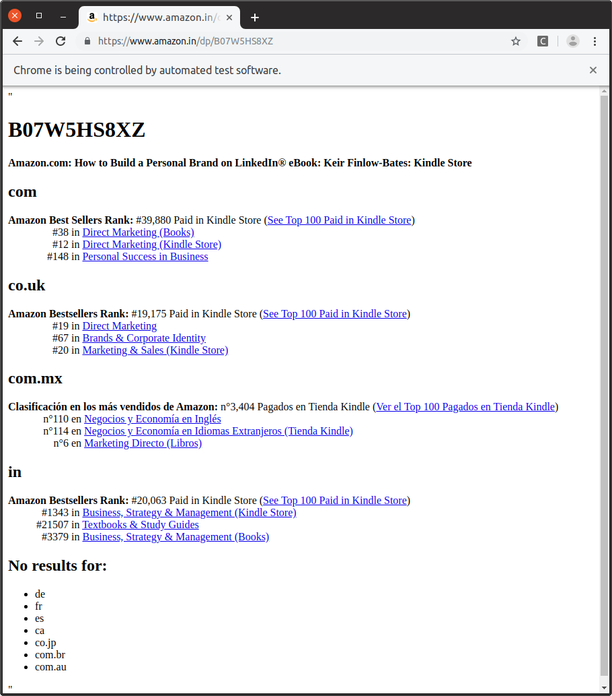

## Scrape all Amazon sites for your product's Amazon Bestseller Rankings

This is a Selenium + Python + ChromeDriver application that takes your Amazin ASIN product identifier as its first and only argument, visits each site in turn, scrapes the data and presents your cross-site rankings in the Selenium window at the end.

Install with `sudo ./install.sh`

Activate environment with `source venv/bin/activate`

Run with `python amazon-bestseller.py <ASIN>`

This script requires ChromeDriver, which can be downloaded from https://chromedriver.chromium.org/downloads

Get the one that matches your current Chrome install and put it in `~/.local/bin/`

For example:

`(venv) kf106@media-pc:~/amazon-bestseller$ python amazon-bestseller.py B07W5HS8XZ`

